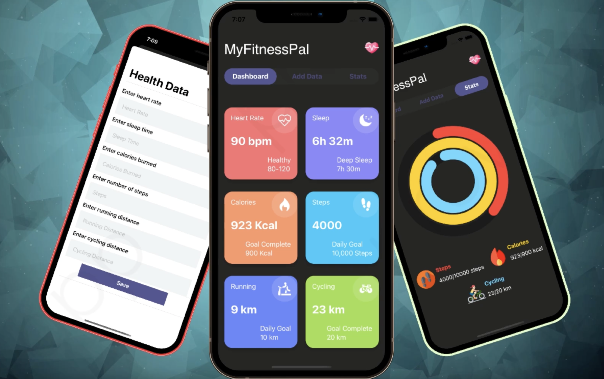

 

<h1 align="center">My Fitness Pal</h1>
 
 
 Good health is linked with physical fitness. When we are in good health, we are happier, more energetic, charming, and alert. In this project, we develop a fitness health app to track fitness objectives that must be met in order to maintain optimal health. 

